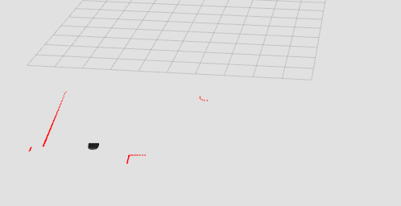

# Computational Robotics: Warming up
_ENGR3590: A Computational Introduction to Robotics, Olin College of Engineering, FA2020_

_Siddharth Garimella_

Descriptions of my approaches to a series of exercises used to develop familiarity with the simulation tooling/robot platform follow.

## Janitor (class)

There seemed to be a lot of mumbo-jumbo getting the robot just to move and spit out scan data, so I started by forking `teleop_twist_keyboard.py` from somewhere on the internet into a small wrapper for commanding and accessing data from the robot. I encoded some simplifications into this wrapper, setting defaults for the positional z axis and angular x & y. Rospy pub/sub and pose information is also managed internally. Scan data is split into mins within 8 sections: N, NW, W, SW, S, SE, E, NE, and maxed to a value of 10. This minimizes indexing work (just 8 numbers) and prevents us from having to deal with `inf` readings out of the laser, while allowing enough data through to get through the warmup.

## Teleop

Sends keyboard commands to the class above running on a different thread. Mapped keys to W, A, S, D to commands I'd written that publish to `cmd_vel`. 

| key | lin.vel.x | ang.vel.z | repr    |
|:---:|:---------:|:---------:|:-------:|
|  w  |    1      |    0      | &uarr;  |
|  a  |    0      |    -1     | &larr;  |
|  s  |    0      |    0      | &#9940; |
|  d  |    0      |    1      | &rarr;  |

If you really wanted to you could easily add trim buttons to play around with velocities more. I didn't, though.

## Drive in a square

Makes the robot turn right for 3.12 seconds. Makes the robot go forward for 3 seconds. Repeats.

Timing the 90 degree turn took a couple tries. I understand it's recommended to use the robot clock for timing, but I went with time.sleep as this is not a particularly intricate behaviour.

## Following a wall

A method validates if there are detections within a distance threshold in the inter/cardinal directions I filter scan data into by default, separating this into eight straightforward cases that try to keep and track the wall on the east.

* **OUTSIDE N NW NE**: Find the wall, slight left to do so
* **INSIDE N; OUTSIDE NW NE**: About to run into something, turn right to avoid
* **INSIDE NE; OUTSIDE N NW**: Tracking the wall on the east, go forward
* **INSIDE NW; OUTSIDE N NE**: Find the wall, slight left to do so
* **INSIDE N NE; OUTSIDE NW**: A little to close to the wall, go right
* **INSIDE N NW; OUTSIDE NE**: Opposite the wall, hard right
* **INSIDE N NW NE**: Too close to the wall, hard right until facing away
* **INSIDE NW NE; OUTSIDE N**: Choose to track the east, turn right

On meeting none of the cases, the last action is continued.

## Following a person

Exclusions of N, NW, and NE can be used to control the robot in a similar fashion as the above. On checking for satisfying cases here, an additional check is done to immobilize the robot upon being 1m in proximity to the "person" object. Cases here involve:

* **INSIDE NE; OUTSIDE N NW**: Turn right
* **INSIDE NW; OUTSIDE N NE**: Turn left
* **INSIDE N NE; OUTSIDE NW**: Slight right
* **INSIDE N NW; OUTSIDE NE**: Slight left
* **INSIDE N**: Locked on, just go forward until immobilized

## Avoiding obstacles

No cases, here. Instead, I took three steps to ensure the robot avoids obstacles and attempts to maintain its original course. 

* Proportional control the angular velocity to remain close to the original orientation
* Modify this angular velocity by an equation of the form `k/[distance reading]` in both the NW and NE directions (with opposite signs)
* Set the linear velocity to `[distance reading]/k` for the reading in the N direction

Choosing constants that allow these to interact appropriately makes this enough to achieve basic obstacle avoidance, while keeping heading.

## Finite state controller

Here, I combined the behaviours of following a wall, and following a person. The condition to switch between the states was determined by the proximity of the nearest object. By default, the robot follows a wall at a range of 2m. If an object enters within 1m of the robot, the robot decides to follow the object instead, and leaves the wall.

This was accomplished by modifying the default behaviour of each set of cases (i.e. what happens if none of the cases are met), and modifying the boundary checker to always return `False` when objects enter and exit banded ranges. When an object is close, the wall boundary checker returns `False` instead of validating any of the inter/cardinal directions, exiting the wall behaviour and raising a flag to switch to the person following behaviour.

## Summary

Cases and cardinal directions can go surprisingly far, when enumerated methodically. Smoother behaviour can probably be obtained from more rigourous mathematical representations and controllers, but there is also sophisticated emergent behaviour from case-based approaches that are likely equally robust and require less fiddling around with asympotic behavioured edge cases. 

